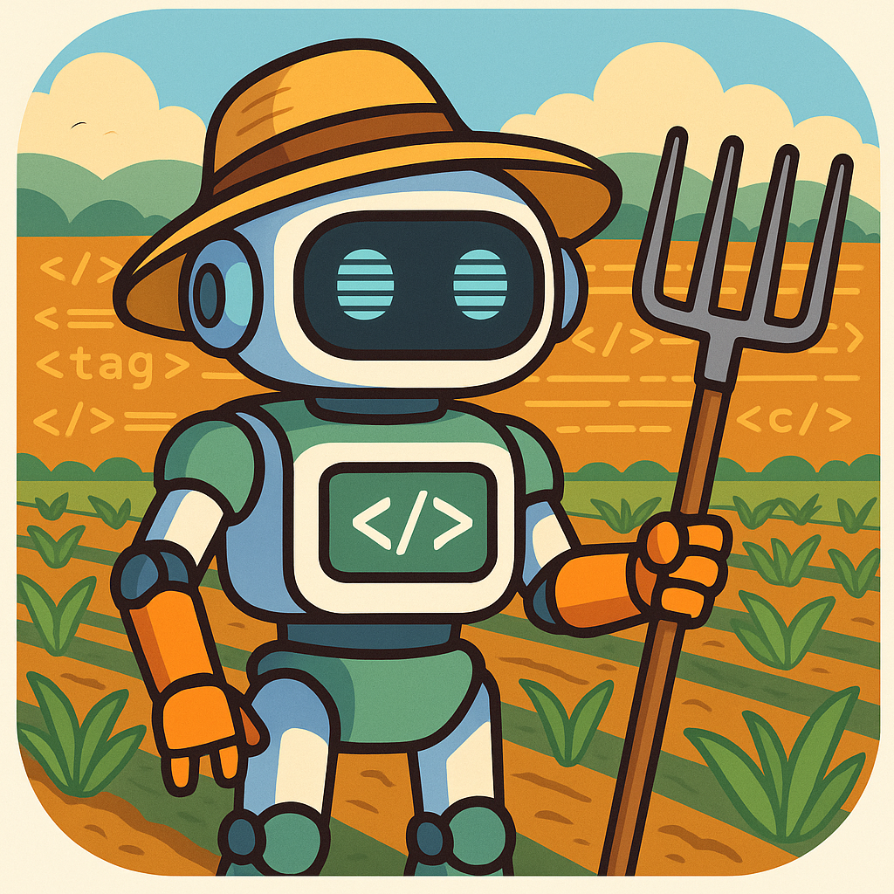
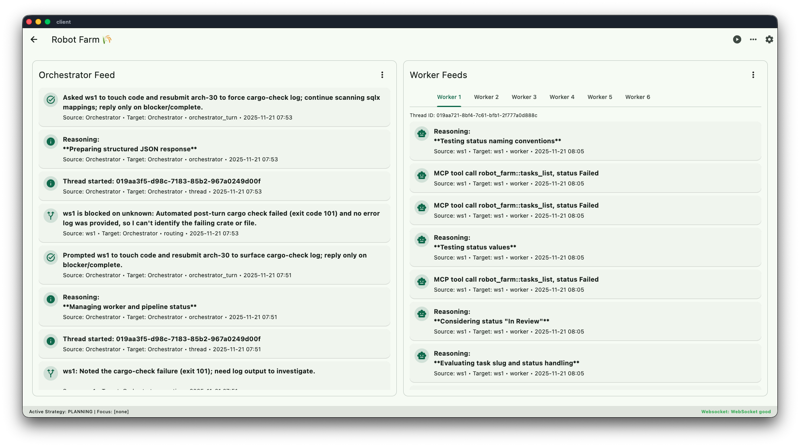

# 🌾 Robot Farm RS

<p align="center">
  
</p>

<p align="center">
  
</p>

Robot Farm is a containerized agent stack for building software at light speed. Multiple Codex instances (workers + orchestrator) hack away inside isolated git worktrees while the Axum server keeps CI, git merges, and automation in sync. 🧑‍🌾🤖

## 🧭 Quick Start

1. **Clone** this repo somewhere + your target repo inside a workspace (see "System Overview" for file system layout).
2. **Run the server**:
   ```bash
   cargo run -p server -- --workspace /path/to/workspace
   ```
   The server builds the shared Docker image, seeds the SQLite DB, and exposes the Axum API + websocket feed on `:8080`. Alternatively, you would use `PORT=8680 cargo run -p server -- --workspace /path/to/workspace` if you wanted to set the port number to something other than the default. You run this command inside the workspace, one level above the repository.
3. **Launch the Flutter client** (real-time feed + task management UI):
   ```bash
   cd client
   flutter run -d macos # (or your favorite target)
   ```
4. 📡 **Connect** the client to the server’s host:port, and you’ll see worker feeds, task groups, queue controls, and more.

Until installation has been fleshed out, here's a server startup script you can add to your PATH
```bash
#!/usr/bin/env bash

WORKSPACE_DIR="$(pwd)" # launch server from inside your workspace, capturing the directory beforehand
export PORT="${PORT:-8080}" # Set port to 8080 if not provided 

pushd /path/to/robot-farm-rs # change this to the path you cloned this project to

cargo run -- --workspace "$WORKSPACE_DIR" 

popd # return you to your workspace when the server exits
```

Now if you name that script something like `robot-farm.sh`, you can navigate to your workspace and run `PORT=8680 robot-farm.sh` and it will launch without all the extra effort.

## 🧱 System Overview

```
┌────────────────────────┐        ┌────────────────────────┐
│ Flutter Client (GetX)  │◄─WS───►│ Axum /ws (feed+workers)│
│  • Orchestrator feed   │        ├────────────────────────┤
│  • Worker feeds        │        │ REST API (tasks, git…) │
└──────────▲─────────────┘        └──────────┬─────────────┘
           │                                 │
           │ feed events                     │ REST
           │                                 ▼
    ┌─────────────┐    intents   ┌───────────────────┐
    │Queue Manager│─────────────►│Database Manager   │
    │(post-turns) │◄─────────────│(serialized SQLx)  │
    └─────┬───────┘              └───────────────────┘
          │
          │process directives    ┌──────────────────┐
          ▼                      │ Process Manager  │→ Docker/Codex
    ┌─────────────┐◄────────────►│ (spawns codex)   │
    │Middleware   │ (batching)   └──────────────────┘
    └─────────────┘
```
```
📁 <WORKSPACE_DIRECTORY> <- This is what you set as --workspace 
├── 📁 .robot-farm-rs    <- Config location (auto-generated & seeded w/ defaults on startup)
├── 📁 directives        <- Optional storage area for AGENTS files
├── 📁 scripts           <- Scripts that live outside your project (typically for code validation, condensing command outputs, etc.)
├── 📁 staging           <- Orchestrator (non-bare) repository **REQUIRED: must exist before launching**
├── 📁 ui-testing        <- Example non-participating worktree
├── 📁 ws1               <\
├── 📁 ws2               <-\
├── 📁 ws3               <--\__ Worker worktrees (generated from inside flutter client)
├── 📁 ws4               <--/
├── 📁 ws5               <-/
└── 📁 ws6               </
```

- As long as you have a non-bare repository called `./staging` in the workspace you can launch the server. It will seed the database & configs, and from the UI you can add worktrees.

### 🛠️ Configuration
Stored in WORKSPACE_DIRECTORY/.robot-farm-rs (editable from Flutter UI, with hot reload!). No need to edit this file directly.
```json
{ // Used to generate AGENTS.override.md
  "append_agents_file": {
    "orchestrator": [ "../directives/AGENTS.orchestrator.md"],
    "worker": ["../directives/AGENTS.compact.md"]
  },
  "models": {
    "orchestrator": "gpt-5.1-codex",
    "worker": "gpt-5.1-codex",
    "wizard": "gpt-5.1-codex"
  },
  "reasoning": {
    "orchestrator": "medium",
    "worker": "medium",
    "wizard": "medium"
  }, // Commands available for post_turn_checks and workers/orchestrator
  "commands": [
    {
      "id": "cargo-check",
      "exec": [ // Example command with example output sanitizer (potentially massive input token savings!)
        "bash",
        "-lc",
        "cargo check --workspace -q --color never --message-format json 2>/dev/null > >(../scripts/sanitize_cargo_check.ts)"
      ],
      "stdout_success_message": "Cargo workspace check reported no errors!", // Optional (exit 0) message instead of build warnings/info
      "hidden": true, // Optionally hide this tool from AIs 
      "timeout_seconds": 999, // Specify timeout (required)
       "cwd": "./" // Optionally specify CWD for command invocation, relative to worktree folder
    }
  ],
  "post_turn_checks": ["cargo-test"] // Run these at the end of a worker's turn, send results to worker on failure
}
```

## 🎛️ Host Commands

- You can specify commands that run on the host machine. Adding args is intentionally disabled so Codex cannot inject shell commands into the host.
- You may choose to hide these commands so Codex cannot run them (strongly recommended in most cases). Some projects have a very specific order of operations for proper building and testing (e.g. migrating database before validating SQL queries, generating FFI before static analysis, etc.) and despite best efforts, Codex will eventually forget the precise order to run tooling, see errors due to missing previous steps, and runs the risk of fixing a problem that only required them to run a previous build step. Encouraging them to rely on COMPLETE_TASK intent and post turn validation enforces build order at the system level. Hiding tooling sometimes frustrates Codex and despite best efforts to inform them that testing and code validation is done automatically when they complete tasks, they might try to download SDKs into your software project. I recommend disabling networking, configuring MCP servers for fetching code docs, and setting sandbox to "danger-full-access". That way they have the autonomy to write code without approvals and can fetch information without CURL or downloading tooling into the project.
- You can specify CWD of the command relative to the worktree. Some commands expect to be run inside specific folders which is why this setting exists.
- I recommend keeping post-turn validation scripts outside of worktrees (`../scripts/your-script-here.sh`). You can design them to strip useless outputs (e.g. warnings from `cargo clippy`, DB migrations that ran without errors but produced 1000's of lines of output, etc.) so Codex only sees what's really important. This is extremely handy for optimizing token usage and maintaining focus. Storing the scripts inside the worktree can sometimes result in workers removing output sanitization code and go back to burning through tokens or pedantically chasing useless warnings. Command outputs are just as bad as prompt injection when you want AIs to maintain focus. If you have to put them inside the worktrees, consider using git submodules and maintaining a separate repo for them. This way you can check out any changes they might make using an external post validation script before the other scripts run. Doing that might cause workers to wonder why their edits are being undone automatically though, and the goal should be to remove any potential scheming opportunity.
- If you store scripts outside of worktrees, you gain the benefit of keeping sensitive environment information (API tokens) out of the worktree where Codex can see them, and eliminate the possibility of accidentally committing `.env` (e.g. codex deletes `.gitignore` or accidentally patches over `.env` and it auto-commits). 
- You can add host commands to the "On staging change" hooks. So whenever staging receives a merge or fast-forward from another worktree, you can have Robot Farm perform actions as a result of that. I use this to send `r` key to a tmux window with flutter in debug mode so it triggers a hot reload automatically. Can be used for anything!

## 🛠️ Development Tips

- Need extra tooling in Codex containers? Drop a Dockerfile fragment at `<WORKSPACE>/.robot-farm/Dockerfile`; the server folds it in when building the `robot-farm-orchestrator_*` & `robot-farm-worker_*` images.

## 📖 Context Recommendations

`append_agents_file` is a powerful config. For best results, follow these guidelines:

- **Orchestrator:** Append an extremely condensed version of what you normally use in regular sessions. The orchestrator should be acutely aware of the project at an architectural level (enough to make task assignment decisions) and that's all. If you provide too much project information, the orchestrator will forget to assign tasks and in some cases begin editing code themselves. Start with an empty project-specific directive and build from there.
- **Worker:** You typically provide a full-sized AGENTS file to workers. If your existing file is relatively large (>16KB), you may consider condensing it. Testing has shown that AGENTS chains exceeding 16KB results in "acknowledgement loops." Where instead of writing code the worker will tell the orchestrator about how it's going to write code but never actually writes anything. The orchestrator is aware of this situation and has special instructions for handling this automatically, but excessively large AGENTS files increases the risk of this substantially. Experiment with this by starting up the server and reading the AGENTS.override.md file size. Also look at the ratio of worker's built-in directive compared to the one you're providing. 50% robot farm and 50% project specific is a good balance.
- **AGENTS Composition:** You can append multiple files and you can change this configuration during runtime. Files are canonically resolved relative to the worktree folder, so if you want to store directives in the workspace you may use `../` to escape the worktree. This canonicalization applies to other path-based configs including commands and post-turn validation.

## 🏛️ Architecture

### 🧩 Client Highlights

- **ConnectionController** keeps the HTTP + websocket connection alive and exposes a `feedEvents` stream other controllers subscribe to.
- **OrchestratorFeedController / WorkerFeedController** fetch initial feed snapshots (`/feed`) and merge websocket events to show a continuous log.
- **Task UI** supports create/edit/delete with guards (built-in groups like `chores`, `bugs`, `hotfix` can’t be deleted in the UI or API).
- **Task Wizard** a special Codex designed to import massive task groups and edit tasks using natural language

### 💾 Database Manager
- Single-threaded broker for SQLx actions (message queue, feed entries). Other modules submit typed intents and await structured responses.
- Guarantees order (write → realtime broadcast) and keeps axum handlers clean of SQL boilerplate.

### 🔁 Middleware
- Buffers `ProcessIntent`s and reduces them to launch/kill directives. Maintains inflight state so priorities and cancel signals stick even under bursty loads.

### ⚙️ Process Manager
- Spawns dockerized Codex runs, streams stdio, enforces kills.
- Worker runs are parsed for `WorkerTurn` payloads; on exit the parsed turn (intent + completion data) is emitted as a notification back to the queue manager.

### 🧠 Queue Manager
- Releases worker assignments, runs configured `post_turn_checks`, auto-commits/merges worker worktrees, and records feed/validation events.
- Pipes every persisted feed entry into the realtime broadcaster (see below) so the UI stays up-to-date without polling.

### 📡 Realtime Feed
- `realtime::publish(FeedEntry)` pushes events into a global `broadcast::channel`.
- `/ws` streams worker snapshots + feed events to all connected clients; the Flutter app listens and updates orchestrator + worker tabs live.


## 🚗 Road Map

- "Stakeholder" mode: a dedicated worktree where a stakeholder may iterate over UI design (use VPN, provide connection details), submits to code review bot who merges it into a worker tree, creates and assigns a task to that worker
- Scheming watcher: a fast and dirt cheap API bot (like grok-code-fast-1 or gpt-5.1-codex-mini, or even gpt-5.1-nano) to watch reasoning messages and identify whether they are drifting from the task or scheming to break out of the sandbox. Can create scripted responses based on the category to automatically realign the worker.
- Task-Specific AGENTS: the ability to inject additional, task-specific information about a task into the AGENTS pipeline for workers.

## 🤝 Contributing

1. Fork + PR welcome! Please describe the subsystem you touched (queue/middleware/process/db) as they’re tightly coupled.
2. Run the integration smoke tests: `cargo test` (server) and `flutter test` (client) if you touched Dart.
3. Document behavior changes in `AGENTS.md` or this `README` so future Codex runs understand the architecture.

Happy farming! 🌱
